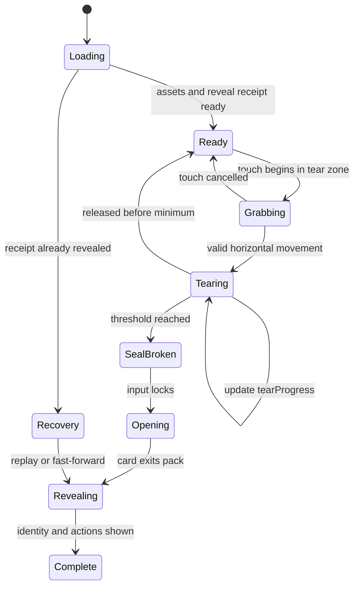
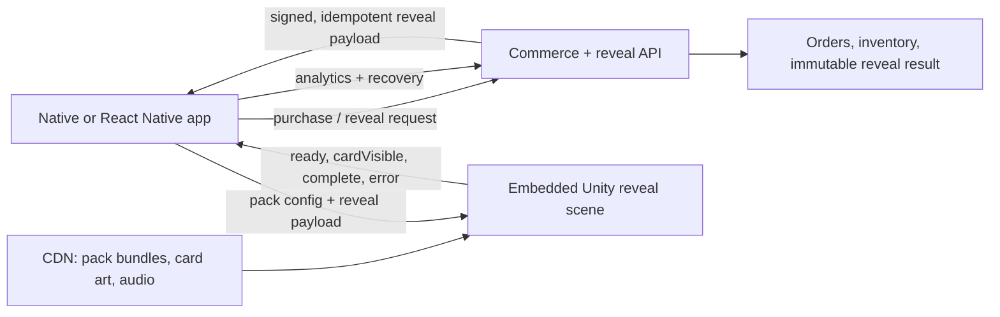

# Trading Card Pack Rip — Technical Blueprint

## Recommendation

Build the pack-opening experience as a small **Unity 6 scene embedded inside the mobile app**, while keeping commerce, inventory, accounts, and the collection UI in the app’s normal UI framework.

Recommended production stack:

| Layer | Technology | Language |
|---|---|---|
| Shared pack-opening renderer | Unity 6, Universal Render Pipeline, Timeline, Addressables, Input System | C# + Shader Graph/HLSL |
| iOS app shell | SwiftUI/UIKit | Swift |
| Android app shell | Jetpack Compose | Kotlin |
| Backend | Existing API stack; TypeScript/Node, Kotlin, Go, or similar | Team choice |
| 3D asset creation | Blender + Substance 3D Painter/Designer or equivalent | Artist tools |
| Content delivery | Object storage + CDN; Unity Addressables remote catalog | JSON + asset bundles |

If the surrounding app is already React Native, keep it. Add a native full-screen `PackRevealView` that hosts Unity. The React Native layer remains TypeScript; thin iOS and Android bridges are Swift and Kotlin. Do not rebuild the entire product in Unity.

Unity is the strongest fit because one C# implementation can ship the same mesh deformation, shaders, particle systems, camera choreography, haptics timing, and touch logic on iOS and Android. Unity officially supports embedding its runtime in native apps through “Unity as a Library.” Its Addressables system also supports remote content updates, which is useful when new pack art and reveal themes ship frequently without a full app release.

## What the user is really seeing

The convincing effect does not require a physically accurate foil simulation. Most production experiences are better understood as a controlled illusion:

1. A low-poly, slightly inflated pack mesh uses branded PBR textures.
2. The top strip is a separate skinned mesh or blend-shaped mesh.
3. The finger does not cut arbitrary geometry. It advances along a predefined jagged tear path.
4. A shader reveals that tear path while a rig curls the detached strip.
5. A Timeline takes over after the threshold and performs the camera, pack, card, lighting, particles, audio, and haptic reveal.
6. The card result was already assigned by the server. The animation only presents it.

This approach is faster, more controllable, easier to art-direct, and much more reliable than real-time cloth tearing.

## Scene construction

### Pack model

Create one reusable pack prefab with these parts:

- `PackBody`: front, back, sides, and bottom.
- `TopStrip`: separate geometry with 6–10 bones across its width.
- `InnerFoil`: visible only after the tear.
- `CardStack`: hidden inside the pack; usually only the winning card must be rendered.
- `TearGuide`: an invisible local-space spline used for gesture projection.
- `TouchPlane`: an invisible collider slightly in front of the pack.
- `RevealAnchor`: the transform to which the revealed card moves.

Use a modest mesh—roughly 2,000–8,000 triangles for the pack and strip. The silhouette, normal map, roughness variation, and lighting sell the material more than dense geometry.

### Texture template

Every pack design should use the same UV layout:

- Front art region
- Back art region
- Side gussets
- Top and bottom crimp
- Tear-edge region

Per pack, provide:

- Base color/albedo
- Normal map for foil wrinkles and crimping
- Metallic/smoothness mask
- Optional emissive mask
- Optional rarity/theme LUT or gradient

Use 2K textures for hero-quality packs and ASTC compression on mobile. A 1K fallback is valuable for lower-memory devices. Pack art, material settings, audio, and effects should be data—not duplicated code.

### Tear illusion

Use a pre-authored black-and-white tear mask. The shader compares the mask’s path position with a `tearProgress` value from `0...1`.

Conceptually:

```hlsl
float edge = SAMPLE_TEXTURE2D(_TearProgressMap, sampler_TearProgressMap, uv).r;
float torn = step(edge, _TearProgress);
clip(1.0 - torn);
```

In practice, use two renderers:

- The body clips pixels above/beyond the tear.
- The strip reveals a jagged lower edge and is animated by its bone chain.

Add a thin bright/dark rim around the active cut using `smoothstep` to make the exposed edge legible. A second material renders the inner foil.

The top strip’s curl can be driven by:

- A 1D blend tree keyed by `tearProgress`, or
- A scripted bone curve, with each successive bone delayed slightly.

Avoid general-purpose cloth simulation for the primary effect. It is harder to reproduce exactly across devices and is less art-directable.

## Gesture model

The gesture should feel free, but remain constrained:

1. Raycast the finger to `TouchPlane`.
2. Convert the hit point to pack-local coordinates.
3. Project it onto `TearGuide`.
4. Convert its distance along the guide into normalized progress.
5. Allow only small backward movement; otherwise keep progress monotonic.
6. Smooth with a low-pass filter.
7. Fire micro-haptics and small foil crackle events at authored progress markers.
8. At `0.92–0.97`, lock input and transition to the cinematic.

This avoids requiring the user to trace a perfect line while preserving the feeling that their finger caused the tear.

```csharp
using UnityEngine;

public sealed class SwipeTearInteractor : MonoBehaviour
{
    [SerializeField] private Camera sceneCamera;
    [SerializeField] private Collider touchPlane;
    [SerializeField] private TearGuide tearGuide;
    [SerializeField] private PackRipController controller;
    [SerializeField, Range(0f, 0.1f)] private float allowedBacktrack = 0.025f;
    [SerializeField] private float smoothing = 18f;

    private float displayedProgress;
    private float furthestProgress;

    public void HandlePointer(Vector2 screenPoint, bool isDown)
    {
        if (!isDown || !controller.AcceptsTearInput) return;

        Ray ray = sceneCamera.ScreenPointToRay(screenPoint);
        if (!touchPlane.Raycast(ray, out RaycastHit hit, 5f)) return;

        Vector3 local = tearGuide.transform.InverseTransformPoint(hit.point);
        float projected = tearGuide.ProjectToNormalizedDistance(local);
        projected = Mathf.Max(projected, furthestProgress - allowedBacktrack);

        furthestProgress = Mathf.Max(furthestProgress, projected);
        displayedProgress = Mathf.Lerp(
            displayedProgress,
            projected,
            1f - Mathf.Exp(-smoothing * Time.deltaTime)
        );

        controller.SetTearProgress(displayedProgress);
    }
}
```

`TearGuide.ProjectToNormalizedDistance` can sample 32–64 points along a spline, find the nearest segment, and return accumulated arc length divided by total length. This is inexpensive and deterministic.

## Interaction state machine



Keep this state machine explicit. Do not scatter progression across animation callbacks.

```csharp
public enum RipState
{
    Loading, Ready, Grabbing, Tearing,
    SealBroken, Opening, Revealing, Complete, Recovery
}

public sealed class PackRipController : MonoBehaviour
{
    [SerializeField] private Animator packAnimator;
    [SerializeField] private Material tearMaterial;
    [SerializeField] private RevealDirector revealDirector;

    public RipState State { get; private set; } = RipState.Loading;
    public bool AcceptsTearInput =>
        State is RipState.Ready or RipState.Grabbing or RipState.Tearing;

    private bool committed;

    public void MarkReady()
    {
        State = RipState.Ready;
    }

    public void SetTearProgress(float value)
    {
        if (!AcceptsTearInput) return;

        State = RipState.Tearing;
        float p = Mathf.Clamp01(value);
        tearMaterial.SetFloat("_TearProgress", p);
        packAnimator.SetFloat("TearProgress", p);

        if (p >= 0.94f && !committed)
        {
            committed = true;
            State = RipState.SealBroken;
            revealDirector.Play();
        }
    }
}
```

Use a `MaterialPropertyBlock` rather than a unique material instance when multiple packs may appear in the same scene.

## Reveal choreography

A good baseline sequence:

| Moment | Duration | Action |
|---|---:|---|
| Ready pose | Until input | Pack floats subtly; light glints across foil |
| User tear | User-controlled | Strip wrinkles/curls; crackle audio; micro-haptics |
| Separation | 0.25–0.40 s | Strip snaps away; pack mouth opens |
| Anticipation | 0.30–0.60 s | Camera pushes in; interior light grows |
| Card emergence | 0.65–0.90 s | Card rises partly concealed |
| Rarity beat | 0.25–0.70 s | Color/sound hints at tier before identity |
| Full reveal | 0.50–0.90 s | Card rotates into view; name, grade, and rarity appear |
| Inspect mode | User-controlled | Drag to tilt; optional pinch; CTA buttons fade in |

Use Unity Timeline for the authored sequence. Fire named signals such as:

- `SealSnapped`
- `CardVisible`
- `IdentityReadable`
- `RevealComplete`

Audio, particles, haptics, analytics, and the app bridge subscribe to those signals. This is cleaner than hard-coding timestamps.

For card inspection, use a small gyroscope- or drag-controlled rotation and a foil shader:

- Fresnel highlight
- Normal-map sparkle
- View-dependent rainbow gradient
- Masked holographic regions
- Very subtle parallax, clamped to avoid motion sickness

## Reusable content template

Each pack release should be a data record plus art assets:

```csharp
[CreateAssetMenu(menuName = "Card Rip/Pack Definition")]
public sealed class PackDefinition : ScriptableObject
{
    public string packTypeId;
    public GameObject packPrefab;
    public Texture2D baseColor;
    public Texture2D normal;
    public Texture2D materialMask;
    public Texture2D tearProgressMap;
    public AudioClip tearLoop;
    public AudioClip revealSting;
    public Gradient rarityLighting;
    public string addressablesLabel;
}
```

Runtime payload:

```json
{
  "orderId": "ord_123",
  "revealId": "rev_456",
  "packTypeId": "pokemon_silver_2026_07",
  "assetVersion": "12",
  "card": {
    "id": "card_789",
    "frontImageUrl": "https://cdn.example.com/cards/card_789/front.webp",
    "backImageUrl": "https://cdn.example.com/cards/card_789/back.webp",
    "grade": "PSA 10",
    "rarityTier": "grail"
  },
  "receiptSignature": "base64-signature"
}
```

The same scene loads a `PackDefinition`, applies textures, binds the card result, selects the rarity effects, then runs the common state machine. A new pack should normally require no engineering work.

## App and backend architecture



Critical rule: **the animation never selects the card**.

The server should:

1. Validate payment and pack inventory.
2. Assign the card using a cryptographically secure, auditable server process.
3. Persist the order-to-card result transactionally.
4. Return an idempotent reveal ID or signed receipt.
5. Return the same result on every retry.
6. Mark presentation progress separately from ownership.

This protects against retries, app termination, packet loss, duplicate taps, and client tampering. Arena Club publicly describes a cryptographically secure, audited server-side randomization process and separately provides recovery when a reveal is interrupted—good evidence that reveal ownership and reveal animation must be independent.

Suggested bridge contract:

```text
App -> Unity
  prepareReveal(payloadJson)
  beginReveal()
  pauseReveal()
  setMuted(bool)
  disposeReveal()

Unity -> App
  onSceneReady()
  onTearStarted()
  onCardVisible(cardId)
  onRevealComplete(revealId)
  onRevealError(code, recoverable)
```

## Asset delivery and caching

Package the common scene, shaders, and baseline effects in the app. Deliver new pack themes through remote Addressables:

- Core bundle: scene, common pack rig, shaders, baseline audio
- Theme bundle: textures, material profile, optional particles/audio
- Card art: WebP/AVIF through the app’s image CDN
- Manifest: pack type, asset version, hashes, minimum renderer version

Before showing “Swipe to tear”:

1. Verify the reveal payload.
2. Download the required theme bundle.
3. Download the winning card images.
4. Warm the shader variants and instantiate effects.
5. Cache everything.
6. Only then enable input.

If loading fails, show a retry screen without changing the assigned result.

## Performance targets

- 60 fps target; graceful 30 fps fallback.
- Keep the hero scene to roughly 50–100 draw calls on modern phones, lower where possible.
- One dominant real-time light plus baked/reflection lighting.
- Prewarm particles and shaders.
- Pool effects; avoid allocations during the tear.
- Compress textures with ASTC; provide lower-resolution Addressable variants.
- Keep transparent overdraw controlled, especially full-screen glows.
- Test on an older iPhone and a mid/low-tier Android GPU early.
- Respect Reduce Motion: shorten camera moves, remove shake, and offer “Tap to reveal.”
- Provide a Skip control after the result is safely loaded.

## Alternatives and when to use them

### React Native + Rive

Use for a stylized 2D or 2.5D pack. Rive supports runtime state machines and data binding, including dynamic images. It is excellent for small downloads and designer-owned iteration, but it is not the best choice for a convincing textured 3D foil pack, view-dependent materials, dynamic lighting, or a freely rotating graded card.

### React Native + Skia/custom shaders

Use if the team is graphics-heavy and wants a smaller runtime than Unity. It can produce an excellent 2.5D illusion, but the team must build and maintain the mesh deformation, gesture mapping, asset tooling, shaders, scene sequencing, and platform performance work themselves.

### Fully native 3D

Use Metal/RealityKit on iOS and Filament/OpenGL/Vulkan on Android only if avoiding a game engine is a strategic requirement. It creates two rendering implementations and the highest long-term cost.

### Pre-rendered video

Good for an MVP or a background flourish. A transparent or masked video can cover the cinematic after a simple interactive swipe. It is fast to ship but cannot adapt naturally to arbitrary pack art, card angles, lighting, or inspect mode.

## Suggested implementation phases

### Phase 1 — Interaction prototype, 1–2 weeks

- One generic pack
- Touch projection along a fixed tear path
- Shader tear and strip rig
- Placeholder card rise
- Device performance test

Exit criterion: the tear feels responsive and runs smoothly on target low-end hardware.

### Phase 2 — Production vertical slice, 3–5 weeks

- Final art, lighting, audio, haptics, particles
- Full state machine and Timeline
- Server-assigned reveal payload
- App bridge
- Recovery, skip, accessibility, analytics

Exit criterion: one pack can be purchased, interrupted, resumed, revealed, and added to inventory without ambiguity.

### Phase 3 — Template/content system, 2–4 weeks

- `PackDefinition` schema
- Addressables/CDN pipeline
- Artist validation tools
- Rarity effect presets
- Automated screenshot and device tests
- Two additional packs produced without renderer code changes

Exit criterion: a trained artist can ship a new pack theme using approved assets and configuration.

Typical team: one Unity/graphics engineer, one mobile engineer, one backend engineer, one technical artist/3D motion designer, with product/design and QA support. A credible production version is usually an 8–12 week effort for that small team after the product and backend foundations exist.

## Instrumentation

Track:

- `reveal_scene_load_ms`
- `reveal_asset_download_failure`
- `tear_started`
- `tear_completion_ms`
- `tear_abandoned`
- `reveal_skipped`
- `card_visible`
- `reveal_complete`
- `reveal_recovered`
- frame-time percentiles and device/GPU tier

Do not optimize only for spectacle. Measure whether users understand where to swipe, whether the gesture fails, and whether repeat users feel trapped by a long animation.

## Sources

- [Arena Club Slab Packs](https://www.arenaclub.com/slab-packs-2)
- [Arena Club: what happens when a pack is opened](https://arenaclubsupport.zendesk.com/hc/en-us/articles/30719227300123-What-happens-when-I-open-a-Slab-Pack)
- [Arena Club: connection recovery during reveal](https://arenaclubsupport.zendesk.com/hc/en-us/articles/30719515357595-What-if-I-have-connection-issues-during-my-reveal)
- [Arena Club: randomization description](https://arenaclubsupport.zendesk.com/hc/en-us/articles/30719216724251-Is-the-probability-of-getting-a-card-in-a-pack-completely-random)
- [Unity 6: Unity as a Library](https://docs.unity3d.com/6000.0/Documentation/Manual/UnityasaLibrary.html)
- [Unity Addressables: remote content distribution](https://docs.unity3d.com/Packages/com.unity.addressables@1.21/manual/remote-content-intro.html)
- [Unity Input System: touch support](https://docs.unity3d.com/Packages/com.unity.inputsystem@1.19/manual/Touch.html)
- [Rive React Native: state-machine playback](https://rive.app/docs/runtimes/react-native/state-machines)
- [Rive: data-binding overview](https://rive.app/docs/editor/data-binding/overview)
